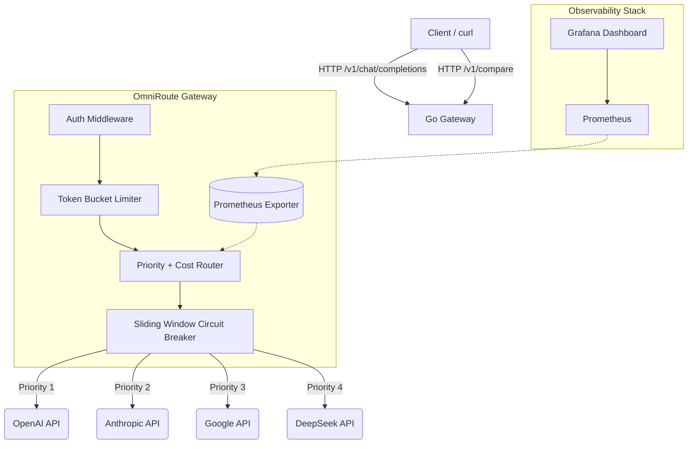

# OmniRoute — Enterprise-Grade Multi-Provider LLM Gateway 🚀

<div align="center">


OmniRoute is a high-performance, highly observable API gateway built in **Go** that unifies and intelligently routes traffic across multiple Large Language Model (LLM) APIs (OpenAI, Claude, Gemini, DeepSeek). 

</div>

---

## 🎯 The Problem It Solves

When building AI applications, relying on a single LLM provider is a critical single point of failure. Providers experience outages, rate limits, and constant price fluctuations. 

**OmniRoute solves this by sitting between your application and the LLM APIs:**
1. **Single Unified API:** Your application talks to OmniRoute using one standard API format. OmniRoute translates and talks to OpenAI, Claude, Gemini, or DeepSeek seamlessly.
2. **Zero Downtime Failover:** If OpenAI is down or rate-limits you, OmniRoute's built-in **Circuit Breaker** instantly routes the request to Claude or Gemini before your user even notices a delay.
3. **Cost-Aware Routing:** Stop overpaying. OmniRoute checks real-time pricing configs and can dynamically route to a cheaper model if your primary model exceeds your budget threshold.
4. **Benchmarking ROI:** The built-in `/v1/compare` endpoint fans out a single prompt to *all* providers concurrently so you can mathematically benchmark Latency, Quality, and USD Cost.

---

## 🏗️ Architecture



---

## ✨ Core Features

- **Concurrent Compare Mode:** A blazing fast `/v1/compare` endpoint that executes a 4-way fan-out using Goroutines. Includes graceful partial-failure handling so one bad API key won't block the other successful requests.
- **Config-Driven Cost Calculator:** A dynamic `pricing.yaml` mapping calculates the exact USD cost of every request in real-time based on input/output tokens. 
- **Pure DSA Resilience:** Built-in Token Bucket Rate Limiting and Sliding-Window Circuit Breakers engineered entirely from scratch without third-party dependencies.
- **Observability Stack:** Deep integration with `prometheus/client_golang` tracks `Requests Total`, `Latency (p95)`, and `Circuit Breaker State`. Ships with a `docker-compose.yml` that provisions Prometheus and a beautiful Grafana dashboard out-of-the-box.
- **Python Evaluation Engine:** Includes an asynchronous Python evaluation suite to blast the gateway with requests and generate a deterministic terminal report proving Quality %, Latency, and Cost.

---

## 🛠️ Quick Start

### 1. Configure Environment
Copy `.env.example` to `.env` and fill in your API keys:
```bash
GATEWAY_API_KEY=my-super-secret-key
OPENAI_API_KEY=...
CLAUDE_API_KEY=...
GEMINI_API_KEY=...
DEEPSEEK_API_KEY=...
```

### 2. Run the Stack (Docker)
The easiest way to start the Gateway + Prometheus + Grafana stack:
```bash
make docker-up
```
- **Gateway API:** `http://localhost:8787`
- **Grafana Dashboard:** `http://localhost:3000` (No auth required)
- **Prometheus:** `http://localhost:9090`

### 3. API Usage

**Standard Completion (with Failover):**
```bash
curl -X POST http://localhost:8787/v1/chat/completions \
  -H "Authorization: Bearer my-super-secret-key" \
  -H "Content-Type: application/json" \
  -d '{"prompt": "Hello!"}'
```

**Compare Mode (All Models Concurrently):**
```bash
curl -X POST http://localhost:8787/v1/compare \
  -H "Authorization: Bearer my-super-secret-key" \
  -H "Content-Type: application/json" \
  -d '{"prompt": "Explain quantum computing in one sentence."}'
```

---

## 📊 Evaluation Engine

Want to prove the ROI of switching models? Run the Python evaluation suite against your local gateway to calculate factual accuracy, TPS, and costs:

```bash
# From the project root:
cd eval
python3 evaluate_models.py
```

*Example Output:*
```text
======================================================================
Model               Quality %   Avg Cost $    P95 Latency
----------------------------------------------------------------------
gemini              100.0       0.000142      0.82ms
claude              100.0       0.000412      1.14ms
openai              100.0       0.000320      0.95ms
======================================================================
```
