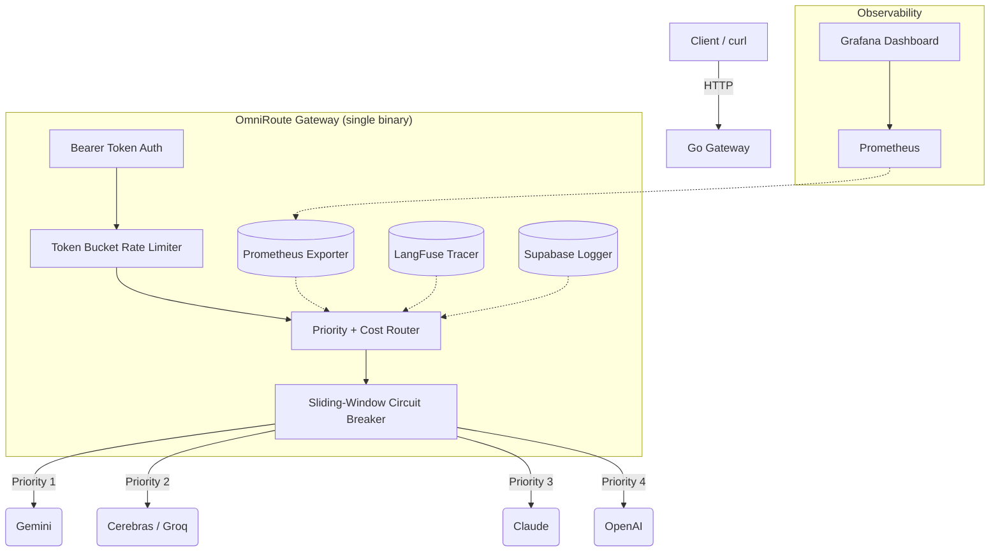

<div align="center">

# OmniRoute

**Production-grade multi-provider LLM gateway built in Go**

Route, compare, and benchmark LLM APIs — with automatic failover, real-time cost tracking, and dual observability.


<br/>

**Zero third-party resilience libraries.** Circuit breakers, rate limiters, and fan-out concurrency — all built from scratch, all tested, all explainable line-by-line.

[Quick Start](#-quick-start) · [API Reference](#-api-reference) · [Architecture](#-architecture) · [Build Philosophy](docs/build_plan.md) · [Configuration](#-configuration)

</div>

---

## Why This Exists

On **September 3, 2026**, a major Azure East US outage took down ChatGPT, Claude, and Grok simultaneously — because all three relied on the same regional cloud. Gemini stayed up on GCP. This exposed a concentration risk that's real and growing.

OmniRoute sits between your application and the LLM providers:

- **Automatic failover** — sliding-window circuit breaker detects timeouts and reroutes before your user notices
- **Side-by-side benchmarking** — one request fans out to all providers concurrently, returns latency + cost + quality for each
- **Single unified API** — your app talks OpenAI-format to OmniRoute, OmniRoute translates to OpenAI, Anthropic, Gemini, or any OpenAI-compatible endpoint
- **Cost-aware routing** — checks real-time pricing config and dynamically routes to a cheaper model when your primary exceeds a threshold

---

## Design Decisions

> Full architecture rationale and what was deliberately scoped out: **[`docs/build_plan.md`](docs/build_plan.md)**

**No third-party resilience libraries.** The circuit breaker uses a sliding-window state machine that trims failure timestamps older than the window duration — same two-pointer pattern as LeetCode 239. The rate limiter is a token bucket with mutex-guarded refill math. Both are under 80 lines each, fully tested, and have zero external dependencies.

**Two observability layers serving different questions.** Prometheus + Grafana answers "what's my p95 latency across all providers?" LangFuse answers "why did *this specific request* take 3.2s?" One is aggregate system health, the other is per-request trace debugging. They're not redundant — they cover different failure modes.

**Config-driven everything.** Provider endpoints, routing priorities, and token pricing all live in YAML. When Gemini dropped their Flash pricing by 40% last month, that was a one-line config change, not a code change and redeploy.

**Deterministic quality scoring.** The evaluation engine scores responses by keyword recall against a fixed dataset with known-correct answers. No LLM-as-judge, no subjective rubrics — every number in the eval output is reproducible.

---

## Architecture



**3 Docker containers.** Gateway + Prometheus + Grafana. Under 1 GB RAM. Cloud services (LangFuse, Supabase, LLM APIs) require no containers.

---

## Core Features

| Feature | Implementation | Why It Matters |
|---|---|---|
| **Concurrent Compare** | `/v1/compare` fans out via goroutines with `context.WithTimeout` and partial-failure handling | One bad provider doesn't block the other results |
| **Sliding-Window Circuit Breaker** | From-scratch state machine: Closed → Open → HalfOpen → Closed | Explains the two-pointer sliding window in an interview, not a library call |
| **Token Bucket Rate Limiter** | From-scratch per-provider rate limiting with `sync.Mutex` | Capacity vs refill rate math, defensible under questioning |
| **SSE Streaming** | `http.Flusher` + `text/event-stream` with `ctx.Done()` cancellation | Client disconnect stops upstream reads — no wasted tokens |
| **Priority + Cost Routing** | Config-driven via `routing.yaml` + `pricing.yaml` | Business rules in config, not code. Swap providers without recompiling |
| **Dual Observability** | Prometheus/Grafana (system) + LangFuse Cloud (per-request traces) | Aggregate health vs individual request tracing — different audiences |
| **Async Cloud Logging** | Supabase PostgREST in a fire-and-forget goroutine | Zero impact on response latency whether Supabase is up or down |
| **Evaluation Engine** | Python script with deterministic keyword-based quality scoring | Real, reproducible cost/quality/latency comparison across providers |

---

## Project Structure

```
.
├── gateway/                        # Go — the entire gateway
│   ├── main.go                     # Entrypoint: config → routes → graceful shutdown
│   ├── config/
│   │   ├── config.go               # Loads .env + YAML configs
│   │   ├── providers.yaml          # Provider endpoints, models, API key env vars
│   │   ├── routing.yaml            # Priority order + cost threshold
│   │   └── pricing.yaml            # Per-provider token pricing (USD/1M tokens)
│   ├── provider/
│   │   ├── provider.go             # Provider interface (Complete, Stream)
│   │   ├── openai.go               # OpenAI-compatible (also Groq, Cerebras, etc.)
│   │   ├── claude.go               # Anthropic native API
│   │   ├── gemini.go               # Google Generative AI REST API
│   │   ├── deepseek.go             # Wraps OpenAI-compat with different base URL
│   │   └── compat.go               # Shared OpenAI-compatible completion helper
│   ├── resilience/
│   │   ├── circuitbreaker.go       # Sliding-window circuit breaker (from scratch)
│   │   ├── circuitbreaker_test.go  # Table-driven state transition tests
│   │   ├── ratelimiter.go          # Token bucket rate limiter (from scratch)
│   │   └── ratelimiter_test.go     # Refill math + burst tests
│   ├── router/
│   │   └── router.go               # Priority + cost-aware routing + circuit breaker integration
│   ├── handlers/
│   │   ├── chat.go                 # /v1/chat/completions (complete + SSE stream)
│   │   └── compare.go             # /v1/compare (concurrent fan-out)
│   ├── middleware/
│   │   └── auth.go                 # Bearer token auth middleware
│   └── metrics/
│       └── metrics.go              # Prometheus counters, histograms, gauges
│
├── eval/
│   ├── eval_dataset.json           # Fixed question set with expected keywords
│   └── evaluate_models.py          # Benchmarking suite: quality, cost, latency
│
├── prometheus/prometheus.yml       # Scrape config
├── grafana/provisioning/           # Datasource + dashboard provisioning
├── docker-compose.yml              # Full stack: Gateway + Prometheus + Grafana
├── Dockerfile                      # Multi-stage Go build
├── Makefile                        # build / run / test / docker-up / docker-down
└── docs/
    └── build_plan.md               # Full design philosophy + phased build approach
```

---

## Quick Start

### Prerequisites

| Requirement | Version | Notes |
|---|---|---|
| **Go** | 1.25+ | For local builds |
| **Docker & Docker Compose** | Latest | For the full stack |
| **Python 3** | 3.10+ | Only for the evaluation engine |

### 1. Clone & Configure

```bash
git clone https://github.com/nikhilsaxena04/OmniRoute-Multi-Provider-LLM-Gateway.git
cd OmniRoute-Multi-Provider-LLM-Gateway
cp .env.example .env
```

Edit `.env` with your API keys:

```bash
# Provider API Keys
GEMINI_API_KEY=your-gemini-key
OPENAI_API_KEY=sk-your-openai-key
CLAUDE_API_KEY=sk-ant-your-key
CEREBRAS_API_KEY=your-cerebras-key
GROQ_API_KEY=gsk-your-groq-key

# Gateway
GATEWAY_PORT=8787
GATEWAY_API_KEY=your-gateway-auth-token

# Observability (optional — gateway works without these)
SUPABASE_URL=https://xyz.supabase.co
SUPABASE_ANON_KEY=your-anon-jwt-key
LANGFUSE_HOST=https://cloud.langfuse.com
LANGFUSE_PUBLIC_KEY=pk-lf-...
LANGFUSE_SECRET_KEY=sk-lf-...
```

### 2a. Run Locally

```bash
make run          # builds + runs the Go binary
```

Or manually:

```bash
cd gateway && go build -o omni-router main.go && ./omni-router
```

Gateway starts on **`http://localhost:8787`**.

### 2b. Run the Full Stack (Docker)

```bash
make docker-up    # Gateway + Prometheus + Grafana
```

| Service | URL |
|---|---|
| **Gateway** | `http://localhost:8787` |
| **Prometheus** | `http://localhost:9090` |
| **Grafana** | `http://localhost:3000` |

```bash
make docker-down  # tear it all down
```

### 3. Verify

```bash
# Health check
curl http://localhost:8787/healthz
# → OK

# Chat completion (routes to best available provider)
curl -X POST http://localhost:8787/v1/chat/completions \
  -H "Authorization: Bearer $GATEWAY_API_KEY" \
  -H "Content-Type: application/json" \
  -d '{"prompt": "Say hello in one sentence"}'

# Compare all providers (concurrent fan-out)
curl -X POST http://localhost:8787/v1/compare \
  -H "Authorization: Bearer $GATEWAY_API_KEY" \
  -H "Content-Type: application/json" \
  -d '{"prompt": "Explain quantum computing in one sentence."}'

# SSE Streaming
curl -N -X POST http://localhost:8787/v1/chat/completions \
  -H "Authorization: Bearer $GATEWAY_API_KEY" \
  -H "Content-Type: application/json" \
  -d '{"prompt": "Tell me a joke", "stream": true}'

# Prometheus metrics
curl http://localhost:8787/metrics
```

---

## API Reference

All protected endpoints require `Authorization: Bearer <GATEWAY_API_KEY>`.

### `GET /healthz`

Health check. Returns `200 OK`. No auth required.

### `POST /v1/chat/completions`

Routes a prompt to the best available provider based on priority and cost rules.

```json
{
  "prompt": "Your question here",
  "stream": false
}
```

| Field | Type | Required | Default | Description |
|---|---|---|---|---|
| `prompt` | string | ✅ | — | The user prompt |
| `stream` | bool | ❌ | `false` | `true` for Server-Sent Events streaming |

**Non-streaming response:**
```json
{
  "Text": "The model's response...",
  "InputTokens": 15,
  "OutputTokens": 42,
  "Cost": 0.000293,
  "Provider": "gemini_3_6_flash"
}
```

**Streaming response:** SSE chunks as `data: <text>\n\n`, ending with `data: [DONE]\n\n`.

### `POST /v1/compare`

Fans out to **all** configured providers concurrently. Returns results from each, including any errors.

```json
{
  "prompt": "Your question here"
}
```

**Response:**
```json
{
  "results": [
    {
      "provider": "gemini_3_6_flash",
      "response": { "Text": "...", "InputTokens": 10, "OutputTokens": 30, "Cost": 0.00032, "Provider": "gemini_3_6_flash" },
      "latency": "1.234s",
      "cost": 0.00032
    },
    {
      "provider": "claude_3_haiku",
      "error": "API returned status 429",
      "latency": "0.5s"
    }
  ]
}
```

### `GET /metrics`

Prometheus-compatible. No auth required. Exposes:
- `gateway_requests_total` — Counter by endpoint, provider, status
- `gateway_request_duration_seconds` — Histogram of latencies
- `gateway_circuit_state` — Gauge per provider (0=Closed, 1=Open, 2=HalfOpen)

---

## Configuration

All YAML config lives in `gateway/config/`.

### `providers.yaml` — Provider Definitions

```yaml
providers:
  gemini_3_6_flash:
    base_url: "https://generativelanguage.googleapis.com/v1beta"
    model: "gemini-3.6-flash"
    type: "gemini"                  # Protocol: "openai", "gemini", or "claude"
    api_key_env: "GEMINI_API_KEY"

  cerebras_llama_8b:
    base_url: "https://api.cerebras.ai/v1"
    model: "llama3.1-8b"
    type: "openai"                  # Any OpenAI-compatible endpoint
    api_key_env: "CEREBRAS_API_KEY"
```

| `type` | Protocol | Works With |
|---|---|---|
| `openai` | OpenAI `/chat/completions` format | OpenAI, Groq, Cerebras, DeepSeek, Together AI, any OpenAI-compat API |
| `gemini` | Google Generative AI REST API | Gemini models |
| `claude` | Native Anthropic `/messages` API | Claude models via Anthropic directly |

### `routing.yaml` — Priority & Cost Rules

```yaml
priorities:
  - "gemini_3_6_flash"
  - "cerebras_llama_8b"
  - "groq_qwen_27b"
  - "claude_3_haiku"
  - "openai_gpt_4o_mini"
cost_threshold: 0.05
```

**Routing logic:**
1. Walk the priority list top to bottom
2. Skip providers whose circuit breaker is **open**
3. Skip providers whose `input_per_1m` exceeds `cost_threshold`
4. If *no* provider passes the cost filter, fall back to the **absolute cheapest available**
5. On failure, the circuit breaker records it — after 3 failures in 60s, that provider is temporarily bypassed for 30s

### `pricing.yaml` — Token Pricing

```yaml
pricing:
  gemini_3_6_flash:
    input_per_1m: 0.075     # USD per 1M input tokens
    output_per_1m: 0.30
  cerebras_llama_8b:
    input_per_1m: 0.10
    output_per_1m: 0.10
  claude_3_haiku:
    input_per_1m: 0.25
    output_per_1m: 1.25
```

> **Note:** Prices move fast. These are in config, not code — update `pricing.yaml` before any demo.

---

## Evaluation Engine

Prove the ROI of switching models with real numbers.

```bash
cd eval && python3 evaluate_models.py
```

```
======================================================================
Model               Quality %   Avg Cost $    P95 Latency
----------------------------------------------------------------------
gemini_3_6_flash    100.0       0.000142      820.0ms
cerebras_llama_8b   100.0       0.000085      245.0ms
groq_qwen_27b      100.0       0.000063      312.0ms
claude_3_haiku      100.0       0.000412      1140.0ms
======================================================================
```

Quality = percentage of expected factual keywords present in the response, scored against a fixed dataset. See the [build plan](docs/build_plan.md#the-evaluation-engine--doing-quality-honestly) for why this method was chosen over LLM-as-judge or other approaches.

---

## Running Tests

```bash
make test
# runs: cd gateway && go test ./... -v
```

Covers:
- Circuit breaker state transitions (Closed → Open → HalfOpen → Closed)
- Token bucket refill math and burst behavior
- All tests run with `go test ./...` — no manual setup required

---

## Makefile Commands

| Command | Description |
|---|---|
| `make build` | Compile the Go binary (`gateway/omni-router`) |
| `make run` | Build and run the gateway locally |
| `make test` | Run all unit tests with verbose output |
| `make docker-up` | Start full stack (Gateway + Prometheus + Grafana) |
| `make docker-down` | Tear down Docker stack |
| `make clean` | Remove compiled binary |

---

## Environment Variables

| Variable | Required | Default | Description |
|---|---|---|---|
| `GATEWAY_API_KEY` | ❌ | *(none)* | Bearer token for auth. If unset, auth is bypassed. |
| `GATEWAY_PORT` | ❌ | `8787` | Port the gateway listens on |
| `GEMINI_API_KEY` | ✅* | — | Google AI Studio key |
| `OPENAI_API_KEY` | ✅* | — | OpenAI key |
| `CLAUDE_API_KEY` | ✅* | — | Anthropic key |
| `CEREBRAS_API_KEY` | ✅* | — | Cerebras key |
| `GROQ_API_KEY` | ✅* | — | Groq key |
| `SUPABASE_URL` | ❌ | — | Supabase project URL (cloud logging) |
| `SUPABASE_ANON_KEY` | ❌ | — | Supabase anon JWT key |
| `LANGFUSE_HOST` | ❌ | — | LangFuse instance URL |
| `LANGFUSE_PUBLIC_KEY` | ❌ | — | LangFuse public key |
| `LANGFUSE_SECRET_KEY` | ❌ | — | LangFuse secret key |

> \* Only required if referenced by a provider in `providers.yaml`. Missing keys cause startup failure.

---

## Troubleshooting

| Issue | Fix |
|---|---|
| `missing required environment variable` on startup | Add the key to `.env` — provider in `providers.yaml` references it |
| All requests route to cheapest provider | `cost_threshold` in `routing.yaml` is too low — increase it or set to `0` |
| `API returned status 401` | Invalid upstream API key — check `.env` |
| `API returned status 429` | Upstream rate limit — circuit breaker will auto-bypass after 3 failures |
| Connection refused on `:8787` | Server not running — `make run` or `make docker-up` |

---

## Technical Decisions Log

| Decision | Rationale |
|---|---|
| **Go over Python** | Goroutines make fan-out cheap; lower memory; faster cold start for a hot-path gateway |
| **No resilience libraries** | Circuit breaker = sliding-window two-pointer. Rate limiter = token bucket. Must be explainable, not imported. |
| **LangFuse Cloud, not self-hosted** | Free tier, same traces, saves 2 Docker containers |
| **Supabase PostgREST** | Zero-dependency HTTP logging — no SQL driver, no ORM |
| **Config-driven pricing** | LLM prices change weekly. YAML over hardcoded constants. |
| **Keyword-based eval scoring** | Deterministic, reproducible, defensible. LLM-as-judge is a stretch goal, not the default. |
| **3 containers, no more** | Gateway + Prometheus + Grafana. Under 1 GB RAM. Runs on anything. |

---

<div align="center">

**[Build Philosophy & Full Design Rationale →](docs/build_plan.md)**

Built by [Nikhil Saxena](https://github.com/nikhilsaxena04)

</div>
