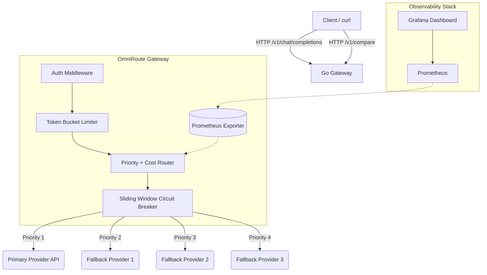

# OmniRoute — Enterprise-Grade Multi-Provider LLM Gateway 🚀

<div align="center">


OmniRoute is a high-performance, highly observable API gateway built in **Go** that unifies and intelligently routes traffic across multiple Large Language Model (LLM) APIs (OpenAI, Claude, Gemini, DeepSeek). 

</div>

---

## 🎯 The Problem It Solves (The Azure Outage)

On September 3, 2026, a major infrastructure failure in Microsoft Azure’s East US region caused a simultaneous, 90-minute blackout across **ChatGPT, Anthropic's Claude, and xAI's Grok** — because all three competitors relied on the exact same regional cloud. Meanwhile, Google's Gemini remained fully operational on GCP. 

This exposed a massive concentration risk in AI infrastructure. If your application hardcodes a single provider (or even multiple providers on the same underlying cloud), you are vulnerable.

**OmniRoute solves this by sitting between your application and the LLMs:**
1. **Zero Downtime Failover:** If an Azure region crashes taking OpenAI down with it, OmniRoute's custom **Sliding-Window Circuit Breaker** instantly detects the timeouts and routes the request to a fallback (like Gemini on GCP or Cerebras) before your user even notices a delay.
2. **Benchmarking ROI & Degradation:** The built-in `/v1/compare` endpoint fans out a single prompt to *all* providers concurrently. You can mathematically benchmark P95 Latency, Quality, and USD Cost to see who is actually performing best during peak congestion.
3. **Single Unified API:** Your application talks to OmniRoute using one standard API format. OmniRoute translates and talks to any OpenAI-compatible, Anthropic, or Gemini REST endpoint transparently.
4. **Cost-Aware Routing:** Stop overpaying. OmniRoute checks real-time pricing configs and can dynamically route to a cheaper model if your primary model exceeds your budget threshold.

---

## 🏗️ Architecture



---

## ✨ Core Features

- **Concurrent Compare Mode:** A blazing fast `/v1/compare` endpoint that executes a 4-way fan-out using Goroutines. Includes graceful partial-failure handling so one bad API key won't block the other successful requests.
- **Config-Driven Cost Calculator:** A dynamic `pricing.yaml` mapping calculates the exact USD cost of every request in real-time based on input/output tokens. 
- **Pure DSA Resilience:** Built-in Token Bucket Rate Limiting and Sliding-Window Circuit Breakers engineered entirely from scratch without third-party dependencies.
- **Observability Stack:** Deep integration with `prometheus/client_golang` tracks `Requests Total`, `Latency (p95)`, and `Circuit Breaker State`. Ships with a `docker-compose.yml` that provisions Prometheus and a beautiful Grafana dashboard out-of-the-box. Also features asynchronous, zero-dependency cloud logging to **Supabase** (PostgREST) and cloud tracing to **LangFuse** (Ingestion API).
- **Python Evaluation Engine:** Includes an asynchronous Python evaluation suite to blast the gateway with requests and generate a deterministic terminal report proving Quality %, Latency, and Cost.

---

## 📁 Project Structure

```
.
├── gateway/                    # Go source code for the gateway server
│   ├── main.go                 # Entrypoint — wires config, routes, server
│   ├── go.mod / go.sum         # Go module dependencies
│   ├── config/
│   │   ├── config.go           # Config loader (.env + YAML parsing)
│   │   ├── providers.yaml      # Provider definitions (URLs, models, API key env vars)
│   │   ├── routing.yaml        # Priority order + cost threshold
│   │   └── pricing.yaml        # Per-provider token pricing (USD per 1M tokens)
│   ├── provider/
│   │   ├── provider.go         # Provider interface (Complete, Stream)
│   │   ├── openai.go           # OpenAI-compatible provider (works with Groq, etc.)
│   │   ├── claude.go           # Anthropic Claude provider (native + OpenAI-compat mode)
│   │   ├── gemini.go           # Google Gemini provider (native REST API)
│   │   ├── deepseek.go         # DeepSeek provider (wraps OpenAI-compat)
│   │   └── compat.go           # Shared OpenAI-compatible completion helper
│   ├── router/
│   │   └── router.go           # Priority + cost-aware routing with circuit breaker integration
│   ├── handlers/
│   │   ├── chat.go             # /v1/chat/completions handler (complete + stream)
│   │   └── compare.go          # /v1/compare handler (concurrent fan-out)
│   ├── middleware/
│   │   └── auth.go             # Bearer token auth middleware
│   ├── metrics/
│   │   └── metrics.go          # Prometheus counters, histograms, gauges
│   └── resilience/
│       ├── circuitbreaker.go   # Sliding-window circuit breaker (from scratch)
│       ├── circuitbreaker_test.go
│       ├── ratelimiter.go      # Token bucket rate limiter (from scratch)
│       └── ratelimiter_test.go
├── eval/
│   └── evaluate_models.py      # Python evaluation/benchmarking suite
├── prometheus/
│   └── prometheus.yml          # Prometheus scrape config
├── grafana/
│   └── provisioning/           # Grafana datasource + dashboard provisioning
├── Dockerfile                  # Multi-stage Go build
├── docker-compose.yml          # Full stack: Gateway + Prometheus + Grafana
├── Makefile                    # Build/run/test shortcuts
├── .env.example                # Template for environment variables
└── .env                        # Your actual secrets (git-ignored)
```

---

## 📋 Prerequisites

| Requirement | Version | Notes |
|---|---|---|
| **Go** | 1.25+ | Required for local builds (`go build`) |
| **Docker & Docker Compose** | Latest | Only if using `make docker-up` |
| **Python 3** | 3.10+ | Only for the evaluation engine (`eval/`) |
| **curl** | Any | For testing API endpoints |

---

## 🛠️ Quick Start

### 1. Clone & Configure Environment

```bash
git clone https://github.com/nikhilsaxena04/OmniRoute-Multi-Provider-LLM-Gateway.git
cd OmniRoute-Multi-Provider-LLM-Gateway
```

Copy the example env file and fill in your API keys:

```bash
cp .env.example .env
```

Edit `.env` with your actual keys:

```bash
# === LLM Provider API Keys ===
OPENAI_API_KEY=sk-your-openai-key       # Or a Groq key if using Groq's OpenAI-compat endpoint
CLAUDE_API_KEY=sk-ant-your-key          # Native Anthropic key (or Groq key if compat mode)
GEMINI_API_KEY=your-gemini-key          # Google AI Studio API key
GROQ_API_KEY=gsk-your-groq-key          # Groq API key

# === Gateway Config ===
GATEWAY_PORT=8787                       # Port the gateway listens on (default: 8787)
GATEWAY_API_KEY=your-gateway-auth-token # Bearer token clients must send

# === Observability ===
SUPABASE_URL=https://xyz.supabase.co
SUPABASE_ANON_KEY=your-anon-jwt-key
LANGFUSE_HOST=https://cloud.langfuse.com
LANGFUSE_PUBLIC_KEY=pk-lf-...
LANGFUSE_SECRET_KEY=sk-lf-...
```

> **Note:** The `api_key_env` field in `providers.yaml` maps each provider to its env var. For example, if all providers use Groq's OpenAI-compatible endpoint, they can all point to `OPENAI_API_KEY`.

---

### 2a. Run Locally (without Docker)

Build and run the Go binary directly:

```bash
# Build
make build

# Run (builds automatically if needed)
make run
```

Or manually:

```bash
cd gateway
go build -o omni-router main.go
./omni-router
```

The server starts on **`http://localhost:8787`** by default.

---

### 2b. Run the Full Stack (Docker)

Starts the Gateway + Prometheus + Grafana all at once:

```bash
make docker-up
```

| Service | URL | Notes |
|---|---|---|
| **Gateway API** | `http://localhost:8787` | Main API |
| **Prometheus** | `http://localhost:9090` | Metrics scraping |
| **Grafana** | `http://localhost:3000` | Dashboards (no auth required) |

To tear it down:

```bash
make docker-down
```

---

### 3. Verify It Works

```bash
# Health check
curl http://localhost:8787/healthz
# → OK

# Chat completion
curl -X POST http://localhost:8787/v1/chat/completions \
  -H "Authorization: Bearer my-super-secret-key" \
  -H "Content-Type: application/json" \
  -d '{"prompt": "Say hello in one sentence"}'

# Compare all providers
curl -X POST http://localhost:8787/v1/compare \
  -H "Authorization: Bearer my-super-secret-key" \
  -H "Content-Type: application/json" \
  -d '{"prompt": "Explain quantum computing in one sentence."}'

# Streaming
curl -N -X POST http://localhost:8787/v1/chat/completions \
  -H "Authorization: Bearer my-super-secret-key" \
  -H "Content-Type: application/json" \
  -d '{"prompt": "Tell me a joke", "stream": true}'

# Prometheus metrics
curl http://localhost:8787/metrics
```

---

## 📡 API Reference

All protected endpoints require `Authorization: Bearer <GATEWAY_API_KEY>` header.

### `GET /healthz`
Health check endpoint. Returns `200 OK` with body `OK`. No auth required.

### `POST /v1/chat/completions`
Routes a prompt to the best available provider based on priority and cost rules.

**Request Body:**
```json
{
  "prompt": "Your question here",
  "stream": false
}
```

| Field | Type | Required | Description |
|---|---|---|---|
| `prompt` | string | ✅ | The user prompt to send to the LLM |
| `stream` | bool | ❌ | Set `true` for Server-Sent Events streaming (default: `false`) |

**Response (non-streaming):**
```json
{
  "Text": "The model's response...",
  "InputTokens": 15,
  "OutputTokens": 42,
  "Cost": 0.000293,
  "Provider": "gemini"
}
```

**Response (streaming):** SSE stream with `data: <text>\n\n` chunks, ending with `data: [DONE]\n\n`.

### `POST /v1/compare`
Fans out the prompt to **all** providers concurrently and returns all results.

**Request Body:**
```json
{
  "prompt": "Your question here"
}
```

**Response:**
```json
{
  "results": [
    {
      "provider": "openai",
      "response": { "Text": "...", "InputTokens": 10, "OutputTokens": 30, "Cost": 0.00032, "Provider": "openai" },
      "latency": "1.234s",
      "cost": 0.00032
    },
    {
      "provider": "gemini",
      "error": "API returned status 429",
      "latency": "0.5s"
    }
  ]
}
```

### `GET /metrics`
Prometheus-compatible metrics endpoint. No auth required. Exposes:
- `gateway_requests_total` — Counter by endpoint, provider, status
- `gateway_request_duration_seconds` — Histogram of latencies
- `gateway_circuit_state` — Gauge per provider (0=Closed, 1=Open, 2=HalfOpen)

---

## ⚙️ Configuration Reference

All YAML config files live in `gateway/config/`.

### `providers.yaml` — Provider Definitions

```yaml
providers:
  openai:
    base_url: "https://api.groq.com/openai/v1"    # API base URL
    model: "openai/gpt-oss-20b"                     # Model identifier
    type: "openai"                                   # Protocol type: "openai", "gemini", or "anthropic"
    api_key_env: "OPENAI_API_KEY"                    # Env var name holding the API key

  gemini:
    base_url: "https://generativelanguage.googleapis.com/v1beta"
    model: "gemini-3.6-flash"
    type: "gemini"
    api_key_env: "GEMINI_API_KEY"
```

**Supported `type` values:**
| Type | Protocol | Used By |
|---|---|---|
| `openai` | OpenAI-compatible `/chat/completions` | OpenAI, Groq, DeepSeek, Together AI, any OpenAI-compat API |
| `gemini` | Google Generative AI REST API | Google Gemini models |
| `anthropic` | Native Anthropic `/messages` API | Claude (when using Anthropic directly) |

> **Tip:** You can route *any* provider through Groq or another OpenAI-compatible endpoint by setting `type: "openai"` and pointing `base_url` to the compat endpoint.

### `routing.yaml` — Priority & Cost Rules

```yaml
priorities:        # Ordered list — first available provider wins
  - "gemini"
  - "openai"
  - "claude"
  - "deepseek"
cost_threshold: 0.05  # Max input_per_1m price (USD). Providers above this are skipped.
```

**How routing works:**
1. Walk down the priority list
2. Skip providers whose circuit breaker is **open**
3. Skip providers whose `input_per_1m` pricing exceeds `cost_threshold`
4. If *no* provider passes the cost filter, fall back to the **absolute cheapest available** provider
5. On failure, the circuit breaker records it — after 3 failures in 60s, that provider is temporarily bypassed for 30s

### `pricing.yaml` — Token Pricing

```yaml
pricing:
  openai:
    input_per_1m: 2.50    # USD per 1 million input tokens
    output_per_1m: 10.00  # USD per 1 million output tokens
  gemini:
    input_per_1m: 1.25
    output_per_1m: 10.00
  deepseek:
    input_per_1m: 0.14
    output_per_1m: 0.28
```

These values are used for:
- **Cost-aware routing** (compared against `cost_threshold`)
- **Per-request cost calculation** (returned in API responses)

---

## 🧪 Running Tests

```bash
make test
```

This runs all Go unit tests, including circuit breaker and rate limiter tests:

```bash
cd gateway && go test ./... -v
```

---

## 📊 Evaluation Engine

Want to prove the ROI of switching models? Run the Python evaluation suite against your local gateway to calculate factual accuracy, TPS, and costs:

```bash
# From the project root:
cd eval
python3 evaluate_models.py
```

*Example Output:*
```text
======================================================================
Model               Quality %   Avg Cost $    P95 Latency
----------------------------------------------------------------------
gemini              100.0       0.000142      0.82ms
claude              100.0       0.000412      1.14ms
openai              100.0       0.000320      0.95ms
======================================================================
```

---

## 🧰 Makefile Commands

| Command | Description |
|---|---|
| `make build` | Compile the Go gateway binary (`gateway/omni-router`) |
| `make run` | Build and run the gateway locally |
| `make test` | Run all unit tests with verbose output |
| `make docker-up` | Start the full stack (Gateway + Prometheus + Grafana) |
| `make docker-down` | Tear down the Docker stack |
| `make clean` | Remove the compiled binary |

---

## 🌍 Environment Variables

| Variable | Required | Default | Description |
|---|---|---|---|
| `GATEWAY_API_KEY` | ❌ | *(none)* | Bearer token for auth. If unset, auth is bypassed (useful for local dev). |
| `GATEWAY_PORT` | ❌ | `8787` | Port the gateway listens on |
| `OPENAI_API_KEY` | ✅* | — | API key for OpenAI-compatible providers |
| `GEMINI_API_KEY` | ✅* | — | API key for Gemini |
| `ANTHROPIC_API_KEY` | ✅* | — | API key for Claude (native mode) |
| `DEEPSEEK_API_KEY` | ✅* | — | API key for DeepSeek |
| `SUPABASE_URL` | ❌ | — | Supabase project URL for cloud logging |
| `SUPABASE_ANON_KEY` | ❌ | — | Supabase anon JWT key |
| `LANGFUSE_HOST` | ❌ | — | LangFuse instance URL |
| `LANGFUSE_PUBLIC_KEY` | ❌ | — | LangFuse public key |
| `LANGFUSE_SECRET_KEY` | ❌ | — | LangFuse secret key |

> \* Only required if the provider references it via `api_key_env` in `providers.yaml`. If a provider's env var is missing, the server will refuse to start.

---

## 🐛 Troubleshooting

| Issue | Cause | Fix |
|---|---|---|
| `missing required environment variable X` on startup | Provider in `providers.yaml` references an env var that isn't set | Add the key to `.env` or export it in your shell |
| All requests route to cheapest provider | Your `cost_threshold` in `routing.yaml` is too low — all providers exceed it | Increase `cost_threshold` or set to `0` to disable cost filtering |
| `API returned status 401` | Invalid API key for the upstream provider | Double-check the key in `.env` matches the provider's expected format |
| `API returned status 429` | Rate limited by upstream provider | The circuit breaker will auto-bypass after 3 failures. Consider adding more providers. |
| Connection refused on `localhost:8787` | Server isn't running | Run `make run` or `make docker-up` |
| `Stream not implemented for Claude/Gemini` | Streaming only works with OpenAI-compatible providers currently | Use `"stream": false` or route to an OpenAI-compat provider |
